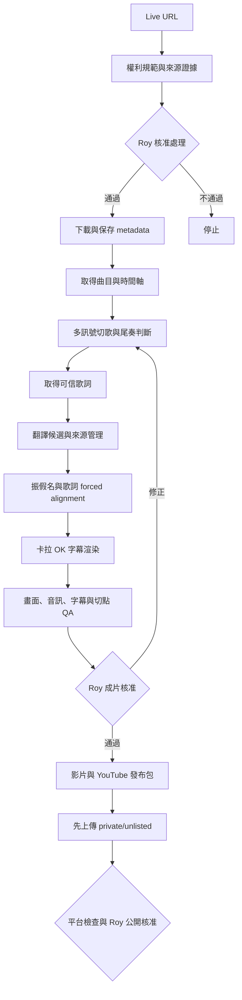
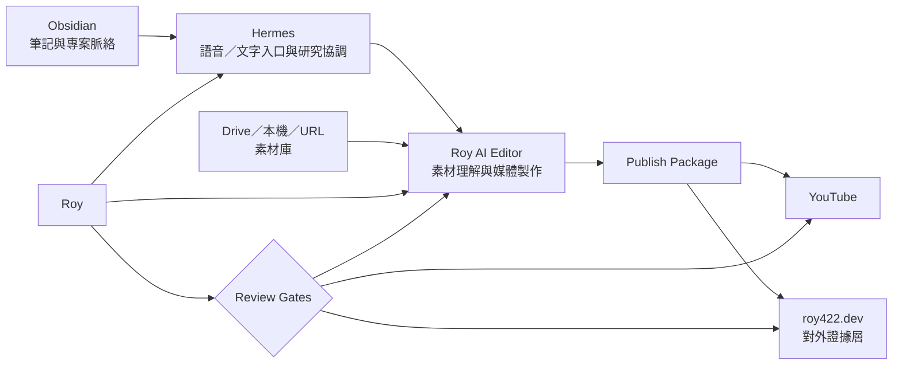

# Roy AI Editor — North Star

> [!abstract] 一句話願景
> Roy 的專屬 AI 剪輯師：接收影片連結、素材庫與自然語言指令，理解內容並自動完成剪輯、字幕、翻譯、生成式素材、品質檢查與發布準備；每個高風險或不可逆步驟保留 Roy 的最終核准。

> [!success] 目前第一優先
> 先把 **Live URL → 版權證據 → 下載 → 分歌 → 找歌詞 → 翻譯 → 振假名 → 卡拉 OK 對軸 → 成片 → YouTube 發布包** 做成穩定、可重播、可評測的流程。其他想像先記入能力地圖，不搶 MVP 主線。

## 1. 為什麼做

Roy 經常觀看 VTuber 3D Live、歌回，也持續累積機器人比賽、開發、旅行與生活素材。現有剪輯流程需要反覆下載、找段落、查歌詞、翻譯、對軸、渲染、檢查與整理發布資訊，門檻高且耗時。

這個專案不只要做一個歌回工具，而是以歌回作為第一個高難度練功場，逐步培養一位理解 Roy 品味、專案與發布渠道的 AI 剪輯師。

它的長期價值包括：

- 讓 Roy 能保存並分享喜歡但較少人剪輯的 VTuber 演出。
- 把機器人比賽、Build Log、Demo 與失敗紀錄變成可理解的影片證據。
- 把旅行或生活素材變成有敘事的成片。
- 把技術文章、研究筆記與科技資訊變成可視化內容。
- 為 [[🗺️ roy422.dev MOC]] 產出影片、GIF、示意動畫、封面與文章素材。
- 未來由 [[🗺️ Hermes Agent x Obsidian MOC]] 作為語音／文字入口，讓 Roy 用自然語言發起與審核製作任務。

## 2. 北極星體驗

理想狀態下，Roy 只需要提供素材與意圖：

> 「這是整場 Live，幫我確認能不能剪，把每首歌分開，做日文振假名、繁中翻譯和卡拉 OK 字幕，先給我審核。」

或：

> 「Google Drive 裡是這次機器人比賽的素材。剪成三分鐘成果影片，再做一支 Short；把失敗、修正與最後成功講清楚。」

系統應能：

1. 盤點來源、權利、素材與可用證據。
2. 理解內容並提出剪輯策略。
3. 產生結構化時間軸與素材計畫。
4. 自動執行可重現的剪輯、字幕、翻譯、生成與渲染。
5. 自動評測切點、聲音、字幕、翻譯與輸出品質。
6. 把不確定、昂貴或有權利風險的項目交給 Roy 核准。
7. 輸出成片與各平台發布包。

核心原則是：**製作盡可能自動；責任決策保留人工確認。**

## 3. 第一個產品切片：Concert Live Workflow

### 3.1 輸入

- YouTube Live／3D Live／歌回網址。
- 使用者提供的曲目時間軸；若沒有，嘗試從影片章節、說明欄或留言區尋找。
- 可選的官方歌詞、翻譯參考、歌手名單與代表色。
- 目標語言與字幕樣式。

### 3.2 流程



### 3.3 完成定義

每一首歌應輸出：

- 完整歌曲影片，開頭自然、尾奏沒有被提前切斷。
- 日文歌詞逐字／音節卡拉 OK。
- 漢字上方正確對位的振假名。
- 繁體中文翻譯。
- 中間停頓、長音、吸氣與無歌詞段落不會讓字幕繼續錯跑。
- 多人演唱時，可指定歌手顏色、合唱樣式與待確認片段。
- 歌詞、翻譯、影像、音樂與二創規範的來源紀錄。
- YouTube 標題、說明欄、Credits、來源、署名、聯絡方式與 Hashtags。
- 上傳前 QA 報告與可快速預覽的低信心片段。

### 3.4 目前品質基線

2026-07-12 的 HACHI Birthday LIVE 2025 原型約為 Roy 主觀 **80 分**：

- 已能完成長片下載、分歌、振假名、繁中翻譯、卡拉 OK 與發布資料。
- 主要缺口是歌唱字幕仍可能漂移、停頓與長音不夠精準、振假名偶爾偏位、多人演唱尚未驗證、翻譯品質與來源流程尚未系統化。
- 《万華鏡》v3 是目前樣式、尾奏與整體觀感的第一個 golden reference。

第一階段目標不是追求抽象的「完全自動」，而是讓同類 Live 能以低人工量穩定達到或超過這個基線。

## 4. 品質與學習迴路

### 4.1 翻譯不是單次模型輸出

歌詞翻譯需要忠實、自然、語境、文學感與可讀性。系統應保存：

- 官方歌詞。
- 模型自行翻譯。
- 有授權或可引用的專業／社群譯文。
- Roy 的選擇、逐句修改與理由。
- 每個候選的來源、譯者、使用條件與署名要求。

先建立可重播的 A/B 比較與評測資料集，再視資料量決定是否做 prompt optimization、reranker、小模型蒸餾或專用翻譯模型。目標是讓較便宜、較小的模型也能穩定接近 Roy 認可的翻譯品味。

翻譯評測至少涵蓋：忠實、自然、上下文一致、文化語感、字幕長度與可唱性。

### 4.2 對軸必須可量測

一般語音 ASR 不足以處理唱歌。Concert Live Workflow 應採：

```text
可信歌詞
  + 人聲／伴奏分析
  + forced alignment
  + 音素／音節時間
  + silence／長音／吸氣
  + 可視化 waveform 與切點
  + regression fixtures
  → 卡拉 OK cue
```

QA 應能自動發現：字幕提前、字幕落後、歌手停了但字仍在跑、長音過早結束、尾奏被切掉、振假名與漢字錯位、字幕遮擋主體與黑幀／音訊爆點。

### 4.3 多人演唱

多人演唱不能只靠 speech diarization。應結合演出名單、聲音、歌詞分配、畫面人物、舞台站位與人工提示，並允許：

- 每位歌手固定代表色。
- 對唱使用不同字幕軌。
- 合唱使用共同或漸層樣式。
- 低信心歸屬標示待確認，不假裝確定。

## 5. 長期能力地圖

### 5.1 素材來源

- YouTube／其他影片網址。
- 本機檔案與資料夾。
- Google Drive 等雲端素材庫。
- 手機影片、圖片、音訊與螢幕錄影。
- Obsidian 筆記、腳本、研究與參考影片。

### 5.2 剪輯 Workflow／Skill

- `concert-clips`：3D Live、歌回、演唱會分歌與多語卡拉 OK。
- `robot-competition`：比賽敘事、成果、失敗、修正、數據與 Demo。
- `build-log`：機器人組裝、Bring-up、測試與工程過程。
- `travel-video`：素材挑選、地點、節奏、配樂與回憶敘事。
- `tech-explainer`：把研究、科技資訊與筆記變成可視化文章和影片。
- `shorts`：由長片或文章產生平台化短影音。

### 5.3 媒體能力

- 自然語言剪輯與 storyboard。
- 逐字字幕、多語翻譯、配音與語音生成。
- 音量正規化、降噪、聲音增強與配樂。
- 色彩、畫質、超解析、穩定與畫面修復。
- 封面、縮圖、圖卡、片頭、片尾與品牌模板。
- GPT Image 等圖片生成。
- Seedance／其他模型的短片與 B-roll 生成。
- SVG／CSS、Manim、Remotion 等確定性示意動畫。
- AI 生成資產的來源、模型、prompt、成本與授權紀錄。

### 5.4 發布與內容分發

- YouTube private/unlisted 自動上傳。
- 平台檢查完成後，由 Roy 核准公開。
- 產生標題、說明欄、章節、Credits、字幕與 Hashtags。
- 為 roy422.dev 輸出文章草稿、封面、GIF、短 Demo、示意動畫與來源資料。
- 未來擴充其他平台與不同長寬比版本。

## 6. 與 roy422.dev、Obsidian、Hermes 的關係



- **Obsidian**：長期筆記、研究、專案脈絡與內容來源。
- **Hermes**：未來可選的語音／文字入口、研究與任務協調者；不是 canonical writer，也不直接處理媒體或控制機器人。
- **Roy AI Editor**：理解素材、規劃、剪輯、生成、渲染、評測與輸出發布包。
- **roy422.dev**：對外證據與內容展示層；嵌入影片、GIF、示意動畫、來源與 Project Pages，不承擔重型影片處理。

參考 [小互 AI 解讀站](https://best.xiaohu.ai/) 的文章形狀：重點摘要、短 Demo、來源提示、客製資訊卡、數據與 SVG／CSS 示意動畫。但 Roy 的版本應更強調工程證據、可重現來源與真正解釋系統怎麼運作。

## 7. 產品與架構原則

1. **站在既有基礎上客製**：Roy AI Editor 以 `Hao0321/video-autopilot-kit` 為 Upstream Foundation，再加入 Roy 專屬的 profiles、能力、Workflow 與品質標準，不在旁邊另做一套互不相干的產品。
2. **通用核心，多個 Workflow／Skill**：Concert Live Workflow 是第一個能力，不把 Repo 綁死在 HACHI、VTuber 或歌回。
3. **Local-first 且程式／素材分離**：canonical source checkout 位於 Dedicated Editor Host；真實 Media Projects 與 Production Assets 位於 `/Volumes/RoyMedia/RoyAIEditor`。雲端模型與儲存是可替換 provider。
4. **確定性引擎＋AI 規劃師**：AI 產生結構化計畫／EDL，程式負責切割、時間、渲染與 QA。
5. **模型可替換**：不綁 Codex 或最頂級模型；每個能力有清楚輸入輸出與 baseline，逐步降低成本。
6. **可重播、可恢復且位置固定**：每個 Media Project 採相同目錄契約，並以 Project Manifest 作為目前狀態的唯一真相；任務、來源、模型版本、時間軸、產物與核准紀錄都能保存、重跑、快取與續跑。
7. **來源與權利是一等資料**：找到內容、允許使用、署名要求與發布風險是不同欄位。
8. **昂貴與不可逆操作先預覽**：生成式 API、上傳與公開發布先顯示成本／請求／風險，再等待批准。
9. **低信心要誠實**：提供證據、信心與預覽，不用流暢文字掩蓋不確定性。
10. **先做 Review UI，不重造完整 NLE**：未來 GUI 優先支援切點、字幕、翻譯與核准，不先複製 CapCut 全部功能。
11. **自動化不能犧牲品味**：敘事、翻譯、音樂收尾與視覺設計必須能學習 Roy 的回饋。
12. **公開客製與私密資料分離**：Public Customization 可與程式碼共同發布；Private Configuration、Production Assets 與授權受限內容不得進入公開 Repo。

## 8. 上游基礎、參考實作與角色

詳細調查見 [[2026-07-12-ai-video-editor-open-source-landscape]]。

- [browser-use/video-use](https://github.com/browser-use/video-use)：agent、逐字稿閱讀、EDL、review loop、cut-boundary self-eval。
- [Hao0321/video-autopilot-kit](https://github.com/Hao0321/video-autopilot-kit)：Roy AI Editor 的 Upstream Foundation；提供 FFmpeg、字幕 QA、CapCut、自動製片、模板與製作知識骨架，Roy 的客製能力與 Workflow 建立在其上。
- [VideoLingo](https://github.com/Huanshere/VideoLingo)：字幕切分、翻譯、對齊與配音參考。
- [WhisperX](https://github.com/m-bain/whisperX)：一般語音逐字時間與 forced alignment baseline。
- [auto-editor](https://github.com/WyattBlue/auto-editor)：dead-space 粗剪與偵測參考，不能直接決定歌曲尾奏。
- [OpenTimelineIO](https://github.com/AcademySoftwareFoundation/OpenTimelineIO)：時間軸領域模型與交換格式參考。
- [Remotion](https://github.com/remotion-dev/remotion)：可選的動態模板與程式化影片 renderer，正式採用前需審查特殊授權。
- [ComfyUI](https://github.com/Comfy-Org/ComfyUI)：可選的本機生成式圖片／影片 workflow backend。
- OpenRouter Seedance 2.0：可替換的 B-roll／短片生成 provider，不是剪輯核心。

採用開源內容時必須核對實際 License、保留必要聲明，並區分「整合程式」、「抽取模組」、「借鑑設計」與「僅觀察」。

## 9. 版本路線

### V0 — 把原型變成可重播流程

- 建立正式 Repo 與 uv 管理環境。
- 固定 Project Manifest、Asset、Timeline／EDL、Artifact 與 Review Gate。
- 把 HACHI 原型素材、切點、字幕與成片保存成 golden fixtures。
- 封裝現有 yt-dlp、FFmpeg、ASS、翻譯與發布包流程。
- 每個階段可以重跑、快取、失敗續跑。

### V1 — Concert Live Workflow 可用

- URL 與權利 evidence collector。
- 時間軸／留言／音訊多訊號分歌。
- 歌詞來源、翻譯 provenance 與 A/B preference dataset。
- 歌唱專用對軸、尾奏偵測、振假名 layout 與 regression tests。
- 多人演唱代表色與低信心 review。
- private YouTube upload 與公開 gate。

### V2 — 通用私人剪輯師

- Google Drive／本機 Asset Library。
- 自然語言 strategy → approval → EDL → render → self-eval。
- Robot Competition、Build Log、Travel 與 Shorts workflows。
- Web Review GUI。

### V3 — 生成式與內容發布

- GPT Image、Seedance 與其他 provider adapters。
- 自動提出 B-roll、圖卡、示意動畫與配音候選。
- roy422.dev Article Package。
- Hermes 語音／文字入口。

版本名稱表示能力成熟順序，不是現在承諾的日期。

## 10. 現階段非目標

- 不現在重造 CapCut／Premiere 等完整 NLE。
- 不現在把 Hermes、roy422.dev、Drive、所有生成模型一次接完。
- 不讓 AI 未經確認直接公開影片。
- 不把「非營利」誤認成版權授權。
- 不把網路找到的歌詞或翻譯自動視為可轉載。
- 不因為模型能產生漂亮影片就忽略技術正確性與 AI-generated 標示。
- 不讓長期想像稀釋 Concert Live Workflow 的近期完成定義。

## 11. 尚未拍板，之後再定

- 正式 Repo 名稱與 GitHub 可見性。
- CLI、Web GUI、Hermes／Discord 的觸發順序。
- Google Drive 同步與素材生命週期。
- Timeline 是否直接採 OpenTimelineIO。
- FFmpeg／ASS、CapCut、Remotion 的長期 renderer 分工。
- 歌唱 forced alignment 的模型與演算法選型。
- 翻譯評測、偏好資料與模型訓練方式。
- AI 生成模型、成本上限與商用授權策略。
- roy422.dev Article Package schema 與元件介面。
- 何時、哪些平台可以進一步自動發布。

## 12. 下一步

1. 以本文件作為方向錨點，不再繼續擴張腦暴範圍。
2. 開正式 `roy-ai-editor` Repo。
3. 先保存本次 HACHI MVP 的程式、設定、字幕、切點、成片與 QA 結果。
4. 定義 V0 最小資料模型與可重播 pipeline。
5. 用《万華鏡》v3 先做第一個 regression test，再遷移其餘歌曲。

> [!quote] North Star
> 給 Roy 一批素材或一個連結，再用人話說明想表達什麼；AI 剪輯師能理解、製作、檢查並交付一套可發布內容，而且每次修改都讓它更懂 Roy 的品味。


- [【全編無料配信】HACHI BIRTHDAY LIVE 2023]( https://www.youtube.com/watch?v=K_9ltFfUrqg)
- [HACHI ！！！！【HACHI / 焔魔るり / 瀬戸乃とと / 水瀬凪】](https://www.youtube.com/watch?v=Ql0A6SyzAYE&t=4310s)
- [【全編無料配信】HACHI Birthday LIVE 2026](https://www.youtube.com/watch?v=kL9pza8dvzw)
- [【 [#獅子神レオナ3D新衣装] ](https://www.youtube.com/watch?v=7-F7B0UiZXE&t=2587s)
- [# 3Dカラオケコラボでライブに向けて盛り上がっていこう！](https://www.youtube.com/watch?v=M4S_E6JomS8)
