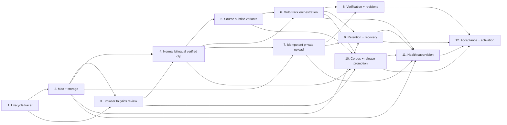

# Concert V1 ticket breakdown — publication record

Parent: [Issue #18](https://github.com/roy4222/roy-ai-editor/issues/18)
Status: published as Issues #19–#30 on 2026-07-19
Gates: FABle `PASS FOR TICKET APPROVAL`; Roy approved granularity, Ticket 9 placement, and blocking edges

## Published Issues

| Ticket | GitHub Issue |
| --- | --- |
| 1 | [#19](https://github.com/roy4222/roy-ai-editor/issues/19) |
| 2 | [#20](https://github.com/roy4222/roy-ai-editor/issues/20) |
| 3 | [#21](https://github.com/roy4222/roy-ai-editor/issues/21) |
| 4 | [#22](https://github.com/roy4222/roy-ai-editor/issues/22) |
| 5 | [#23](https://github.com/roy4222/roy-ai-editor/issues/23) |
| 6 | [#24](https://github.com/roy4222/roy-ai-editor/issues/24) |
| 7 | [#25](https://github.com/roy4222/roy-ai-editor/issues/25) |
| 8 | [#26](https://github.com/roy4222/roy-ai-editor/issues/26) |
| 9 | [#27](https://github.com/roy4222/roy-ai-editor/issues/27) |
| 10 | [#28](https://github.com/roy4222/roy-ai-editor/issues/28) |
| 11 | [#29](https://github.com/roy4222/roy-ai-editor/issues/29) |
| 12 | [#30](https://github.com/roy4222/roy-ai-editor/issues/30) |

## Slicing rules

- Tickets are tracer bullets through durable state, evidence, failure handling, and externally visible behavior; they are not one ticket per class, database table, or adapter.
- The first ticket establishes the highest-level lifecycle seam with fakes. Later tickets replace one bounded fake boundary at a time while preserving the same Production Job contract.
- No ticket may weaken ADR 0001–0047 or `concert-v1-quality@1.0.0`. Production activation is impossible until the final ticket.
- OAuth/channel setup and real Concert URLs are delayed until the first ticket that truly requires them.

## Proposed tickets

### 1. Establish the Concert Production Job tracer bullet

**Blocked by:** none
**Delivers:** A submitted synthetic Concert URL becomes a durable Production Job Request, advances through a minimal manifest state machine using fake browser/media/YouTube adapters, pauses for one hash-bound Concert Lyrics Review, resumes after a sole-review `ok`, and emits a deduplicated fake private-link Delivery Review through Review Outbox.

Scope includes schema/version migrations, immutable evidence references, lease/checkpoint/retry primitives, adapter contracts, remote-side-effect ledger, URL canonicalization, durable inbound Review Replies, and the one highest-level lifecycle harness. Kill/restart and duplicate-request tests must produce the same observable manifest/outbox/result and no duplicate fake side effect. It does not claim media quality or real publishing.

Acceptance requires: preserve the raw submitted URL while mapping supported `youtube.com/watch`, `youtu.be`, embed/shorts/live forms to one validated video ID; strip tracking-only parameters; reject lookalike hosts; and derive duplicate identity from canonical video ID plus selection/profile inputs. A Review Reply has an immutable reply ID, originating task, review ID, displayed artifact hashes, normalized response, receive time and consumer cursor. It is atomically consumed once; replay is a no-op, stale/hash-mismatched replies fail closed, and an unrelated `ok` cannot advance state. Lease defaults are versioned at 15-second heartbeat／60-second TTL; takeover requires TTL expiry plus an unchanged durable heartbeat, with boundary and process-pause tests.

### 2. Make the dedicated Mac host reproducible and storage-safe

**Blocked by:** 1
**Delivers:** The same tracer job runs on a clean dedicated Mac mini release with machine-readable `doctor`, pinned FFmpeg/ffprobe/libass/fonts/Python/browser prerequisites, exact RoyMedia volume identity, stage space estimates, and the 25 GiB hard floor.

Bootstrap is idempotent; wrong/missing volume, APFS mismatch, tool checksum drift, missing font, and low-space fixtures block only affected heavy stages. Production Data Root is `/Volumes/RoyMedia/RoyAIEditor`; no internal-disk media fallback or runtime package installation is allowed. A versioned Private Configuration pins the concrete APFS Volume UUID captured from `diskutil info -plist`; preflight requires exact UUID, mount point, filesystem and external-device attributes. A same-name fake volume must fail, and labels／device nodes alone are never identity.

### 3. Discover a setlist and produce one reviewable Lyrics Packet under enforced read-only browsing

**Blocked by:** 1, 2
**Delivers:** A real or fixture YouTube URL is opened through `roy-concert-discovery`; chapters, description, creator/pinned/credible comments and rights evidence become provenance-complete artifacts; selected tracks proceed through official-Japanese/Bahamut-first research, Song Interpretation Brief, translation reuse assessment, AI-draft fallback, performed repeats, line map, Ruby candidates, and one hash-bound Concert Lyrics Review.

The ticket keeps one Issue but has two ordered acceptance milestones. **3A — enforced capture:** implement ADR 0045 controls/Browser Action Ledger and pass the complete 40-case browser fixture population, including malicious content and mutation traps. **3B — research to review:** only after 3A passes, turn captured evidence into rights findings, interpretation, translation/Ruby candidates and one Lyrics Review. Page content remains untrusted and mutation, unexpected navigation, CAPTCHA, reauthentication, or access control fail closed. Contextual Translation Notebook cases never silently promote rules.

### 4. Produce one verified normal-bilingual concert clip from approved text

**Blocked by:** 2, 3
**Delivers:** One no-source-Japanese Track Job turns approved Lyrics Packet/Ruby Map into a frame-accurate cut, passing line alignment, deterministic bilingual ASS, encoded MP4, per-line original-resolution full-width QA crops, Computer Use evidence cursor, and Verified Render.

The slice includes Boundary Anchor refinement, intro/outro preservation, baseline Alignment Adapter, line-tier degradation, Ruby Evidence Policy, Singer Color fixtures, Concert Subtitle Profile, audio/frame/decode checks, and zero-tolerance text/order/repeat/ruby/pixel gates. It may use the frozen baseline adapter; candidate model promotion remains ticket 10. Any Computer Use line FAIL／ambiguous result or unavailable required second pass blocks Verified Render and creates a hash-bound Track-level Exception Review; it never degrades to PASS.

### 5. Handle complete and partial source Japanese end to end

**Blocked by:** 4
**Delivers:** The same Track Job correctly chooses among Source Japanese Subtitle Mode, Safe-Area Recovery, Normal Bilingual Subtitle Mode after disabling incomplete soft subtitles, and whole-track Caption Region Replacement for incomplete burned subtitles.

All `concert-v1-quality@1.0.0` source-subtitle fixtures pass: 100% complete source is preserved exactly once with Chinese below; 98% soft becomes full normal bilingual; 98% burned either replaces the entire fixed caption region with zero readable residue or produces an exact skip/version-bound Exception Review. Line-by-line mixed modes are impossible.

### 6. Run a concert as isolated, resource-aware Track Jobs

**Blocked by:** 4, 5
**Delivers:** A multi-song Production Job queues and resumes independent Track Jobs, runs only one project heavy slot, parallelizes within the 24 GiB resource registry, releases capacity at human gates, continues passing songs when one fails, and returns one consolidated Exception Digest plus completed results.

This ticket covers bounded retries, track/shared blocker distinctions, stage-scoped invalidation, Local-First compute, operational-impossibility evidence, and no silent external-GPU offload. Restarting during separation/alignment/render must preserve completed checkpoints and output identity.

### 7. Upload one Verified Render privately without duplicates

**Blocked by:** 2, 4
**Delivers:** A Verified Render is uploaded to the exact bound channel as private with `notifySubscribers=false`, using Keychain-held `youtube.upload + youtube.readonly`, a deterministic fsynced Publish Intent, durable resumable-session reference, exact reconciliation marker, and Orphan Upload Reconciliation.

Fake YouTube tests pass all registry fault boundaries; response loss/crash/session expiry yields unique adoption or fail-closed ambiguity, never a second automatic insert. A bounded real private-channel smoke occurs only after Roy’s one-time OAuth/channel binding. Video ID is durable before thumbnail, verification, or outbox delivery; secrets never enter artifacts/logs/vault.

### 8. Verify private uploads and deliver/revise them safely

**Blocked by:** 6, 7
**Delivers:** API processing/playability/visibility checks plus isolated `roy-studio-verify` restriction evidence produce PASS/WARN/FAIL; completed songs appear in one Delivery Review, and a sole-review `ok` selects exact Approved Deliverables without changing visibility.

Timestamped natural-language/screenshot revisions bind to an exact render/video, reopen only affected stages, upload a new private video, preserve the old current version until selection, then mark it Superseded Remote Revision. Remote cleanup and visibility promotion are immutable separately authorized plans executed only by the privileged boundary; normal worker tests prove it cannot update/delete/dispute/promote.

### 9. Retain 30-day media safely and recover irreplaceable project truth

**Blocked by:** 2, 6, 7
**Delivers:** Manifest events assign 7-day reproducible cache, 30-day replaceable media from Retention Eligibility, long-lived truth, and Retention Holds; exact three-day-ahead Retention Plans delete only freshly revalidated eligible files and emit Tombstones.

An encrypted/hash-verified ≤10 GiB internal Recovery Vault snapshots only small irreplaceable truth daily and before deletion/migration/profile promotion. Technical restore-only enforcement requires a separate vault service/OS identity: the Production Worker can request snapshots but has no restore operation; production search paths never include the vault; restore writes only to a new empty staging root, verifies encryption/hashes/schema, and requires an explicit disaster-recovery command plus migration plan before activation. Wrong volume, symlink/traversal, changed hash, active lease, hold, lost remote playability, or failed backup blocks deletion.

### 10. Promote production capabilities and releases against the preregistered corpus

**Blocked by:** 3, 4, 5, 6
**Delivers:** The three bounded Source Subtitle, Live Alignment, and ASS/Ruby/pixel spikes run against the versioned synthetic/private Concert Golden Corpus and `concert-v1-quality@1.0.0`; qualifying adapters are pinned into an immutable Production Toolchain Release.

The Maintenance Train discovers updates, produces isolated candidates, runs CI/corpus/Mac smoke/restart/rollback, and auto-promotes only exact normalized-output-equivalent/no-new-scope results. All other output changes create one A/B Toolchain Promotion Review. Active and last-known-good releases remain runnable; current jobs never switch release.

### 11. Supervise unattended production with stage-specific recovery

**Blocked by:** 2, 6, 7, 9, 10
**Delivers:** An independent launchd Host Health Supervisor runs at boot, every six hours, and pre-job; secret-free snapshots classify each capability/stage PASS/DEGRADED/BLOCKED and perform only bounded restart/resume/backoff/cache-rebuild/last-known-good rollback/already-authorized retention actions.

Fault injection proves network/OAuth only blocks network stages, vault failure only blocks deletion/migration, and low storage blocks heavy writes. Versioned defaults are: Recovery Vault freshness PASS at ≤26 hours and deletion/migration BLOCKED above 26 hours until a fresh verified snapshot; API quota preflight requires planned stage cost plus the greater of 20% or 100 units of reserve; a repeated failure signature receives at most three self-healing attempts within 15 minutes with backoff before one shared blocker. Reauthentication and integrity risk block immediately. Formatting, scope changes, text mutation, access-control bypass, and remote deletion are structurally unavailable.

### 12. Pass Concert V1 acceptance and activate the production default

**Blocked by:** 8, 9, 10, 11
**Delivers:** Three representative real projects and at least 12 Track Jobs/300 subtitle events pass every pinned registry gate and operational drill from URL to verified private links, with no manual JSON/file/shell repair, required editing GUI, duplicate upload, lost review, or unauthorized destructive action.

The resulting Production Activation Review contains corpus/real-project metrics, known limits, exact release/registry hashes, restore/rollback evidence, and rollback instructions. Only Roy’s explicit activation changes default URL intake from development/acceptance to production. Public/unlisted promotion, automatic remote deletion, cloud GPU, and Directed Footage remain out of scope.

## Dependency graph

## Approved review decisions

1. Tickets 4–6 remain separate because their normal-render, source-subtitle and multi-track/resource fixture boundaries are independently verifiable.
2. Retention/recovery remains Ticket 9 after private publishing because permanent-deletion preflight requires remote playability evidence; Ticket 2 provides the interim 25 GiB floor.
3. The dependency graph is accepted. Ticket 3 remains one Issue with ordered milestone 3A (enforced capture) before 3B (research/review), avoiding a thirteenth Issue while containing implementation risk.
